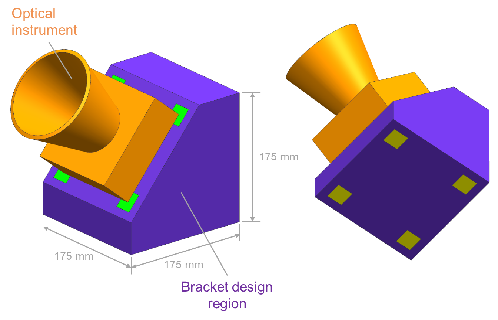

# Multiphysics optical instrument design problem: A JPL design challenge

As additive manufacturing has become more mainstream, academic and industrial
partners have reached out to JPL for "real world" design problems to better
explore this new design space. In response to these requests, a prototypical JPL
design problem is posed here as a design challenge to the public. The primary
intention here is to provide real world context for people to explore new design
methodologies in a framework that is comparable across investigators. The
challenge is thus open ended with no completion date or winners: think of this
more as a benchmark problem similar to the NASA Common Research Model used in
aerodynamics research.

# The design problem overview

This design problem corresponds to the design of a prototypical optical instrument
support bracket as illustrated below. Optical instrument structural design is often driven by two
load cases: spacecraft launch and extreme thermal conditions while in space.
The design problem is thus mutliphysics in nature, requiring a coupled
thermomechanical approach. See [the complete design problem
definition](Multiphysic%20JPL%20design%20problem.pdf) for more details.

# Solution submission process

Please submit your final designs using the [Github issue tracker](https://github.com/nasa-jpl/design-challenge-multiphysics/issues):
- Select "New Issue"
- Under the title, specify "(institution name):(lead submission author)". For 
  example, "Jet Propulsion Laboratory: Ryan Watkins". 
- Within the issue text, submit a summary of results and supporting materials as
 outlined in the second to last slide of [the complete design problem
definition](Multiphysic%20JPL%20design%20problem.pdf).

# General notes

- Although originally inspired by additive manufacturing, designs need not be
restricted to just this manufacturing technique.
- Please cite this design problem as specified in the last slide of [the
  complete design problem
  definition](Multiphysic%20JPL%20design%20problem.pdf).

© 2020 California Institute of Technology. Government sponsorship acknowledged.

